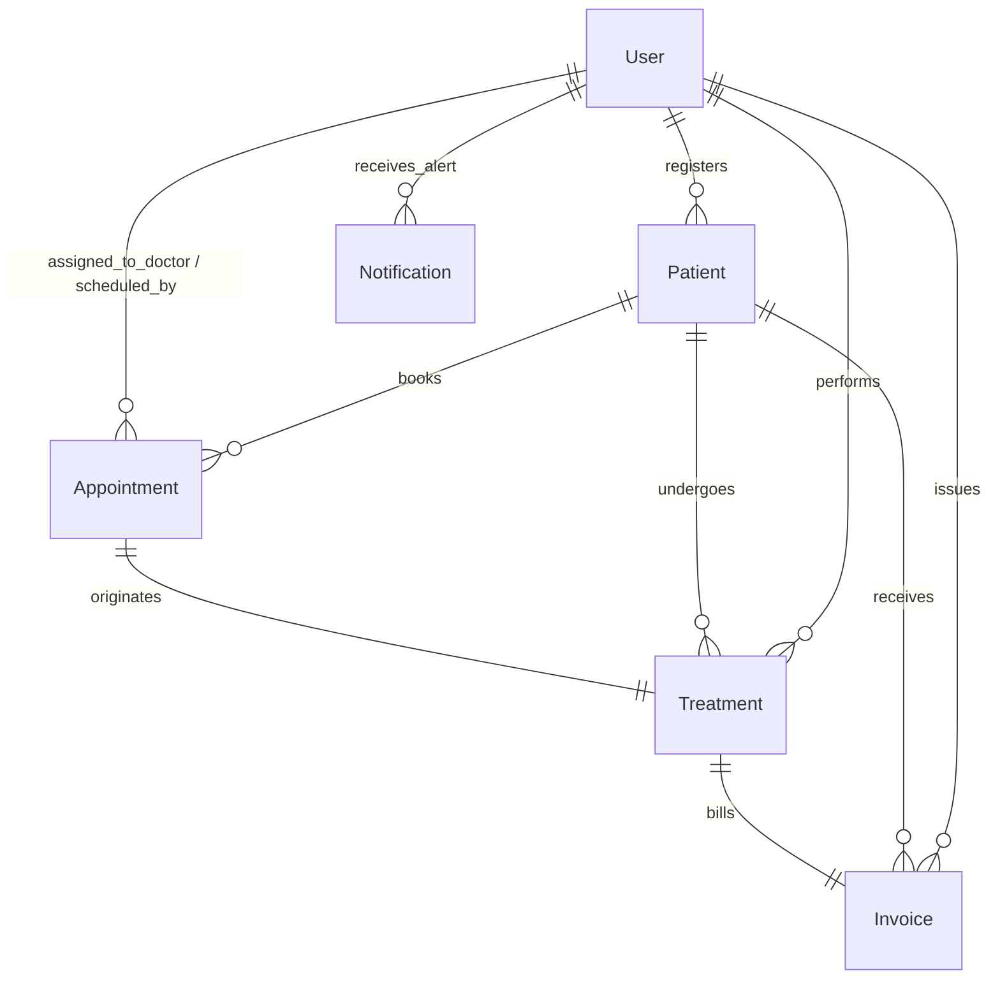

# Dental Clinic Management System API

A professional, feature-rich Restful API built with **Node.js (Express)** and **MongoDB (Mongoose)** designed to handle the complete operational workflow of a modern dental clinic. It manages user authentication, patient tracking, xray file uploads, appointments scheduling, treatment plans, medical billing, automatic inventory checks, and live internal staff alerts.

---

## 🚀 Features by Module

### 1. Authentication & System Access
*   **Secure Authentication**: Secure sign-up and sign-in workflows via password hashing (`bcryptjs`) and stateless `JWT` tokens.
*   **Role-Based Access Control (RBAC)**: Fine-grained middleware authorization for `admin`, `doctor`, and `receptionist` roles.
*   **Password Self-Service**: Integrated secure verification via an optimized 6-digit `OTP` protocol dispatched directly to staff emails with a strict 15-minute expiration cycle.

### 2. Patient Management
*   **Comprehensive Health Records**: Comprehensive indexing of profile metrics, age, contact detail, emergencies, address details, and structured string arrays tracking patient allergies/medical history.
*   **X-Ray Asset Repository**: Up to 5 concurrent xray graphic file attachments via safe multipart stream controls (`multer`) wired directly into cloud server delivery buckets (`Cloudinary`).
*   **Auditing Track**: Captures creator metadata pointing directly back to the registering staff member.

### 3. Appointments Scheduler
*   **Availability Protections**: Validation engine preventing overlapping booking conflicts on identical timeframes under a non-cancelled doctor schedule.
*   **Realtime Scheduling Tracks**: Granular lifecycle tracking spanning through status labels: `عين موعد` (Drafted), `مؤكد` (Confirmed), `جاري العمل` (In-Progress), `مكتمل` (Completed), and `ملغي` (Cancelled).
*   **Advanced Filtering**: High-speed lookup options query records by single specific `doctor`, `status`, or target calendar `date`.

### 4. Medical Services (Clinic Catalogue)
*   **Modular Procedures Directory**: Service classification grouping items into logical divisions: `كشف` (Checkup), `تنظيف جير` (Scaling), `تلميع` (Polishing), `حشو` (Filling), `علاج عصب` (Root Canal), `خلع` (Extraction), and `تركيبات` (Prosthetics).
*   **Safe Soft-Deletion Lifecycle**: Custom patch workflows (`/delete` & `/restore`) toggle runtime accessibility traits without inducing dangling foreign records across historical fiscal summaries.

### 5. Treatment Management
*   **Interactive Treatment Plans**: Couples operational sessions directly to a unique validated appointment.
*   **Automated Multi-Service Accumulators**: Dynamically populates and rolls over costs from multiple concurrent services, ensuring exact individual record pricing constraints.
*   **Plan Lifecycles**: Strict procedural state transitions preventing retrospective data manipulation once plans are marked as `مكتمل` (Completed) or `ملغى` (Cancelled).

### 6. Billing & Invoices
*   **Intelligent Financial Settlement**: Restricts invoice generation exclusively to validated treatment plans marked as `مكتمل`.
*   **Granular Accounting Adjustments**: Supports flexible absolute base discounts and computes real-time math parameters (`subtotal`, `totalAmount`, `paidAmount`, and `remainingAmount`).
*   **Dynamic Installment Registers**: Tracks step-by-step payment tracking over granular statuses: `pending`, `partial`, and `paid`.

### 7. Inventory & Warehouse Logistics
*   **Categorized Material Auditing**: Real-time warehouse ledger grouping stock items into dedicated tracks: `مواد علاج` (Clinical Compounds), `أدوات` (Instruments), `مستلزمات وقاية` (Protective Gear), `أدوية` (Medications), and `أخرى` (Miscellaneous).
*   **Proactive Low-Stock Triggers**: Automated event listener streams evaluating standard quantities against configured minimums (`minQuantity`), immediately queuing internal notifications.

### 8. Live Staff Notifications
*   **Targeted Internal Messaging**: Automated internal alert queues pushing structural diagnostic logs, operational events, and warehouse scarcity metrics directly to specific users.
*   **Reading Diagnostics**: Custom endpoints optimizing pagination and providing individual (`/:id/read`) or bulk read (`/read-all`) patch update commands.

---

## 🛠️ Tech Stack

*   **Backend Framework:** Node.js (Express v5.2.1)
*   **Database Interface:** MongoDB with Mongoose ODM (v9.6.2)
*   **API Standardization & Documentation:** Swagger-UI-Express & Swagger-JSDoc (OpenAPI 3.0.0 Specification)
*   **Storage Infrastructure:** Multer & Multer-Storage-Cloudinary SDK
*   **Security Mechanisms:** Helmet.js headers protection, CORS cross-origin configuration, and BCryptJS encryption
*   **Communication Channels:** Nodemailer via standardized SMTP relays

---

## 📂 Project Structure

```text
C:\Users\dell\Desktop\Freelance Project\Server\
├── .gitignore
├── package.json              # Configuration, scripts, and runtime dependencies
├── README.md                 # System overview and technical documentation
└── src\
    ├── app.js                # Express app configuration & middleware pipeline
    ├── server.js             # Database listener and HTTP node bootloader
    ├── config\
    │   ├── cloudinary.js     # Media cloud pipeline parameters
    │   ├── db.js             # Mongoose MongoDB connection profile
    │   └── swagger.js        # OpenAPI documentation specifications
    ├── controllers\          # Route execution handles and business operations logic
    │   ├── appointmentController.js
    │   ├── authController.js
    │   ├── inventoryController.js
    │   ├── invoiceController.js
    │   ├── notificationController.js
    │   ├── patientController.js
    │   ├── serviceController.js
    │   └── treatmentController.js
    ├── middleware\           # Validation, Auth, and Request preprocessing hooks
    │   ├── authMiddleware.js     # JWT extraction and session dehydration
    │   ├── roleMiddleware.js     # Authorization and RBAC enforcement guards
    │   ├── uploadMiddleware.js   # Binary multipart storage processor
    │   └── validateMiddleware.js # Express-Validator rule interceptor
    ├── models\               # MongoDB schemas & data validation blueprints
    │   ├── Appointment.js
    │   ├── Inventory.js
    │   ├── Invoice.js
    │   ├── Notification.js
    │   ├── Patient.js
    │   ├── Service.js
    │   ├── Treatment.js
    │   └── User.js
    ├── routes\               # Explicit REST route map declarations
    │   ├── appointmentRoutes.js
    │   ├── authRoutes.js
    │   ├── inventoryRoutes.js
    │   ├── invoiceRoutes.js
    │   ├── notificationRoutes.js
    │   ├── patientRoutes.js
    │   ├── serviceRoutes.js
    │   └── treatmentRoutes.js
    ├── utils\                # Calculation helpers, response formatters & notifications
    │   ├── calculateInvoice.js
    │   ├── formatResponse.js
    │   ├── generateToken.js
    │   ├── pagination.js
    │   ├── sendEmail.js
    │   └── sendNotification.js
    └── validations\          # Request constraints and validation rule setups
        ├── appointmentValidation.js
        ├── authValidation.js
        ├── inventoryValidation.js
        ├── invoiceValidation.js
        ├── notificationValidation.js
        ├── patientValidation.js
        ├── serviceValidation.js
        └── treatmentValidation.js
```

---

## 🗄️ Database Collections & Relationships

The database layer relies on **Mongoose ODM references (`ObjectIds`)** to maintain data integrity across collections:



### Collection Blueprints
1.  **Users (`User`)**: System accounts containing login details, role definitions (`admin`, `doctor`, `receptionist`), contact paths, or specialist descriptions.
2.  **Patients (`Patient`)**: Demographic sheets containing emergency contacts, medical records, background notes, and structured arrays tracking binary xray URLs stored on Cloudinary.
3.  **Appointments (`Appointment`)**: Core timetable slots binding a specific `Patient` reference and a target `User` (filtered under role=`doctor`) to an absolute date and time string block.
4.  **Services (`Service`)**: Price list records tracking available clinic procedures with duration variables and structural categories (`حشو`, `خلع`, `علاج عصب`, etc.).
5.  **Treatments (`Treatment`)**: Encounter blueprints locking down an assignment list tracking services rendered, quantities provided, explicit standard price snapshots, and total calculation outcomes.
6.  **Invoices (`Invoice`)**: Financial balancing sheets tracking financial changes against sub-totals, discounts, net amount balances, and embedded payment schema lines logs.
7.  **Inventory (`Inventory`)**: Central storage tracking remaining quantity indices, minimum replenishment margins, unit counts, unit costs, and distributor traits.
8.  **Notifications (`Notification`)**: Targeted system messaging buffers containing state indicators (`isRead`) matching unique recipient accounts.

---

## 🔒 Authentication & Role Matrix

The API uses standard `Authorization: Bearer <JWT>` header flags. RBAC configurations protect routes via dedicated middleware layers:

| API Module | Endpoints Scope | Admin | Doctor | Receptionist |
| :--- | :--- | :---: | :---: | :---: |
| **Auth** | User Registration / Onboarding | ✅ | ❌ | ❌ |
| | Profiling Details (`/me`) | ✅ | ✅ | ✅ |
| **Patients** | Register Patients / Edit Details | ✅ | ❌ | ✅ |
| | Access Patient Chart Files / Upload X-Rays | ✅ | ✅ | ✅ |
| | Full Record Purge (Physical Delete) | ✅ | ❌ | ❌ |
| **Appointments** | Formulate Booking / Modify Dates / Process States | ✅ | ❌ | ✅ |
| | Timetable Overview Lookups | ✅ | ✅ | ✅ |
| **Services** | Append Service / Adjust Cost / Soft Delete Records | ✅ | ✅ | ❌ |
| | General Catalogue Inquiries | ✅ | ✅ | ✅ |
| **Treatments** | Map Treatment Plan / Update Dynamic Sub-Items | ✅ | ✅ | ❌ |
| | Summary Reports Trackers | ✅ | ✅ | ✅ |
| **Invoices** | Issue Invoices / Append Financial Payments Logs | ✅ | ❌ | ✅ |
| | Overview Statements Inquiries | ✅ | ✅ | ✅ |
| **Inventory** | Append Core Stock Profile / Adjust Restock Logs | ✅ | ❌ | ❌ |
| | Read Asset Levels / Consume Runtime Inventory Items | ✅ | ✅ | ❌ |
| **Notifications**| Admin Alert Panel Overviews / Mark Read States | ✅ | ❌ | ❌ |

---

## 📝 Environment Setup (`.env.example`)

Create an absolute `.env` configuration template file directly inside the project root workspace directory:

```env
# Server Network Parameters
PORT=5000
NODE_ENV=development

# Database Connection Path
MONGO_URI=mongodb://localhost:27017/dental_clinic

# Security Encryption Key
JWT_SECRET=your_super_secure_long_random_jwt_secret_phrase

# Media Cloud Provider Parameters (Cloudinary)
CLOUDINARY_CLOUD_NAME=your_cloudinary_cloud_name
CLOUDINARY_API_KEY=your_cloudinary_api_key
CLOUDINARY_API_SECRET=your_cloudinary_api_secret

# Mail Relay Server Constants (SMTP)
EMAIL_HOST=smtp.mailtrap.io
EMAIL_PORT=2525
EMAIL_USER=your_smtp_username
EMAIL_PASS=your_smtp_password
EMAIL_FROM=noreply@dentalclinic.com
```

---

## ⚙️ Installation & Running

### Prerequisites
*   Node.js runtime environment installed (v18+ recommended)
*   Active local or cloud-hosted instance of MongoDB Server

### Step-by-step Setup
1.  **Clone and Navigate to Workspace Directories:**
    ```bash
    cd "C:\Users\dell\Desktop\Freelance Project\Server"
    ```

2.  **Install Application Packages Ecosystem:**
    ```bash
    npm install
    ```

3.  **Configure Environment Parameters:**
    *   Duplicate `.env.example` to create a workable `.env` layout.
    *   Populate matching authentication connection values for MongoDB, Cloudinary, and your mail relay server.

4.  **Run Development Mode (Hot-Reload Enabled):**
    ```bash
    npm run dev
    ```
    *The system boots locally by default on: `http://localhost:5000`*

---

## 📖 API Documentation Dashboard

The system features fully integrated, automated, production-level API routing blueprints available through a stylized browser console interface.

*   **Interactive OpenAPI Sandbox Path:** `http://localhost:5000/api-docs`

This interface provides real-time access to operational details, required request schemas, multipart form data formats, security scopes, and mock response configurations.

---

## 🛡️ Built-in Security Architectures

1.  **Secure HTTP Headers Protection (`Helmet`)**: Extinguishes diagnostic tracking paths, mitigates cross-site scripting (XSS) risks, and hardens application server environments.
2.  **Validated Request Sanitization (`Express-Validator`)**: Runs inline route parsing logic via customized validation arrays, stripping injection scripts and preventing bad request schemas from reaching database engines.
3.  **Strict Transaction Guardrails**: In-controller validation checks prevent common accounting errors, such as processing a discount higher than subtotal figures, double-billing identical medical appointments, or consuming items past actual warehouse availability limits.
4.  **Cryptographic Asset Sanitization**: Sanitizes reset credentials at rest inside MongoDB collections by transforming raw OTP indicators into deep irreversible `SHA-256` digest formats.

---

## 🔮 Planned Enhancements
*   **Persistent Warehouse Log Ledgers**: Tracking chronological asset changes with complete inbound/outbound staff verification stamps.
*   **Automated Patient Reminder Pipelines**: Triggering automatic SMS or WhatsApp notices ahead of scheduled appointments.
*   **Granular Financial Analytics Panels**: Providing detailed revenue streams graphs comparing material expenditure directly against procedural earnings.

---

## 📄 License
This project is registered under standard **ISC License** constraints. Review explicit operational rules inside the base `package.json` manifest.
